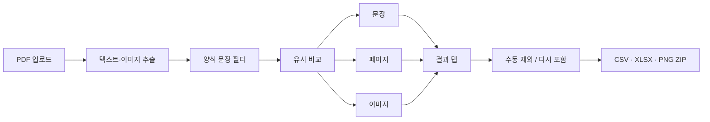

[한국어](README.md) | [English](README_EN.md)

# 문서 간 유사 콘텐츠 분석기

여러 PDF 파일 간 **비슷한 문장·페이지·이미지**를 찾아주는 내부 검토용 도구입니다.

---

## 실행

```bash
python -m venv .venv
source .venv/bin/activate      
pip install -r requirements.txt
streamlit run app.py
```

---

## 활용 순서




### 결과 탭 구성


| 탭           | 내용                             |
| ----------- | ------------------------------ |
| **분석 요약**   | 처리 로그 + 문장 겹침·유사도 분포·파일×파일 통계  |
| **유사 문장**   | 비슷한 문장 쌍 표 + 나란히 비교            |
| **유사 이미지**  | 비슷한 그림 쌍 (pHash)               |
| **유사 페이지**  | 페이지 전체 텍스트가 비슷한 쌍              |
| **페이지 PNG** | 유사 페이지 A/B 비교 (유사한 부분 하이라이트)   |
| **제외 문장**   | 자동 제외 확인 · 수동 제외 입력 · 문장 다시 포함 |


---

## 주요 기능

- **PDF 문장·페이지·이미지** 비교 (동일 문장 우선, 이후 임베딩 유사도)
- **양식 문장 자동 제외** (패턴·라벨형·짧은 공통 문구) — 사이드바 ON/OFF
- **수동 제외** — 단어/문장 입력 시 유사 문장·통계·페이지 PNG에서 제외
- **페이지 PNG** — 하이라이트 + 「이 페이지가 묶인 근거」(A↔B 문장·유사도)
- 다운로드: `similar_*.csv`, `similarity_analysis.xlsx`, `matched_pages.zip`

---

## 프로젝트 구조

```text
app.py                 # Streamlit UI (전체 흐름)
requirements.txt
src/
├── features/          # 신규 기능 (수동 제외 · 자동 제외 복원)
│   ├── manual_exclude.py
│   └── excluded_restore.py
├── ui/                # 탭 UI
│   └── excluded_sentences_tab.py
├── parsers/           # PDF 파서 (+ 다른 형식 스텁)
├── analyzers/         # 문장·페이지·이미지 유사도
├── models/            # 데이터 스키마
└── utils/             # 설정, 양식 필터, 페이지 PNG, 통계, 내보내기
```
