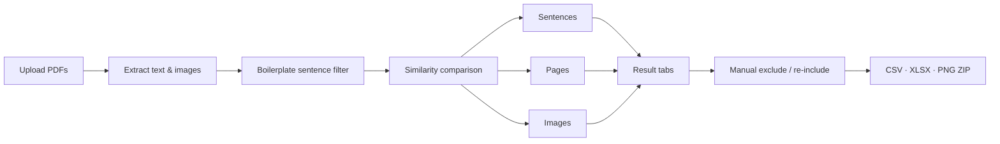

[한국어](README.md) | [English](README_EN.md)

# Cross-Document Similar Content Analyzer

An internal review tool that finds **similar sentences, pages, and images** across multiple PDF files.

---

## Run

```bash
python -m venv .venv
source .venv/bin/activate      
pip install -r requirements.txt
streamlit run app.py
```

---

## Workflow




### Result tabs


| Tab | Contents |
| --- | --- |
| **Analysis summary** | Processing log + sentence overlap · similarity distribution · file×file stats |
| **Similar sentences** | Similar sentence-pair table + side-by-side comparison |
| **Similar images** | Similar image pairs (pHash) |
| **Similar pages** | Pairs where full-page text is similar |
| **Page PNG** | Side-by-side A/B page comparison (highlight similar regions) |
| **Excluded sentences** | Confirm auto-exclusions · enter manual exclusions · re-include sentences |


---

## Key features

- Compare **PDF sentences, pages, and images** (exact matches first, then embedding similarity)
- **Auto-exclude boilerplate** (patterns · label-like · short shared phrases) — sidebar ON/OFF
- **Manual exclude** — enter words/sentences to remove them from similar sentences · stats · page PNG
- **Page PNG** — highlights + “why these pages were matched” (A↔B sentences · similarity)
- Downloads: `similar_*.csv`, `similarity_analysis.xlsx`, `matched_pages.zip`

---

## Project structure

```text
app.py                 # Streamlit UI (full flow)
requirements.txt
src/
├── features/          # New features (manual exclude · restore auto-exclusions)
│   ├── manual_exclude.py
│   └── excluded_restore.py
├── ui/                # Tab UI
│   └── excluded_sentences_tab.py
├── parsers/           # PDF parser (+ stubs for other formats)
├── analyzers/         # Sentence · page · image similarity
├── models/            # Data schemas
└── utils/             # Config, boilerplate filter, page PNG, stats, export
```
